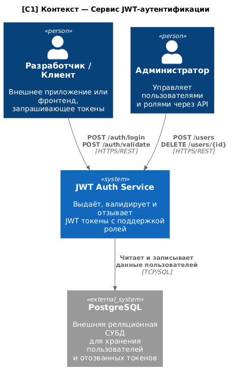
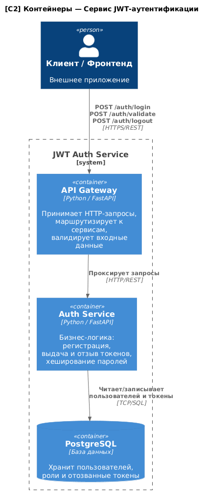
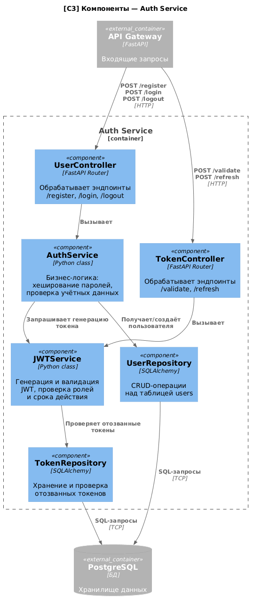

## Problem Statement

Система генерации и валидации JWT токенов предназначена для разработчиков
и системных администраторов, которым необходимо управлять аутентификацией
в микросервисных приложениях. Основные функции: регистрация пользователей
с назначением ролей (admin, user, moderator), выдача подписанных JWT
access- и refresh-токенов, валидация токенов с проверкой роли и срока
действия, а также отзыв токенов (logout). Система взаимодействует
с PostgreSQL для хранения пользователей и отозванных токенов,
а также предоставляет REST API для внешних клиентских приложений.

---

## Диаграммы

### C1 — Контекст

[Исходный код](diagrams/context.puml)

| Аспект | Что сгенерировал ИИ | Что исправлено вручную | Обоснование |
|---|---|---|---|
| Внешние системы | Добавил Redis без необходимости | Удалён Redis | На уровне C1 он не нужен, усложняет контекст |
| Подписи на стрелках | Абстрактные "uses" | Заменены на конкретные эндпоинты | Повышает читаемость |
| Роли пользователей | Один общий "User" | Разделён на Developer и Admin | Отражает реальные роли |

### C2 — Контейнеры

[Исходный код](diagrams/container.puml)

| Аспект | Что сгенерировал ИИ | Что исправлено вручную | Обоснование |
|---|---|---|---|
| Технологии | Не указал стек | Добавлен Python/FastAPI | Соответствует плану реализации |
| Границы системы | Не было System_Boundary | Добавлен System_Boundary | Требование нотации C4 |
| Связи | Однонаправленные без подписей | Добавлены протоколы (HTTP, TCP/SQL) | Уточняет способ взаимодействия |

### C3 — Компоненты (Auth Service)

[Исходный код](diagrams/component.puml)

| Аспект | Что сгенерировал ИИ | Что исправлено вручную | Обоснование |
|---|---|---|---|
| Структура | Один монолитный сервис | Разделён на Controller/Service/Repository | Соответствует паттерну layered architecture |
| Репозитории | Отсутствовали | Добавлены UserRepository и TokenRepository | Инкапсуляция работы с БД |
| Связь JWT и Auth | Не было зависимости | Добавлена явная связь AuthService → JWTService | Отражает реальную логику |

---

## Вывод

ИИ полезен для быстрой генерации скелета диаграмм и правильного синтаксиса 
PlantUML, однако требует ручной доработки: галлюцинирует лишние компоненты, 
не всегда корректно расставляет типы элементов и упускает детали взаимодействия. 
Для архитектурного проектирования ИИ целесообразно использовать как стартовую 
точку, но не как финальный инструмент.
