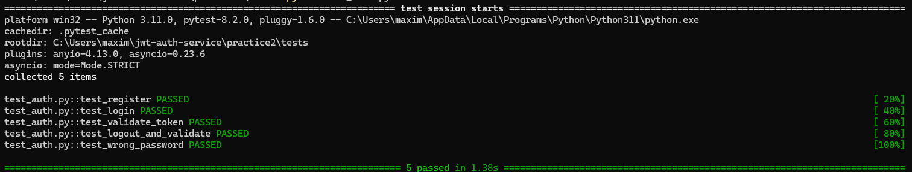
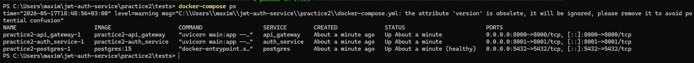

# Практика №2 - Реализация MVP с использованием ИИ

**Тема:** Сервис генерации и валидации JWT токенов с ролями (Тема 19)  
**Студент:** Фокин Максим Юрьевич, группа ИКМО-06-25

---

## Ссылка на репозиторий

https://github.com/LonginOme/jwt-auth-service

---

## Архитектура микросервисов

Client → API Gateway (8000) → Auth Service (8001) → PostgreSQL (5432)

**API Gateway** - принимает все внешние HTTP-запросы и проксирует их в Auth Service.  
**Auth Service** - бизнес-логика: регистрация, хеширование паролей, генерация и валидация JWT.  
**PostgreSQL** - хранит пользователей, роли и отозванные токены.

---

## Использованные ИИ-инструменты

- **Claude (claude.ai)** - генерация скелета микросервисов, кода FastAPI эндпоинтов,
  структуры БД, docker-compose конфига и автотестов.

---

## Примеры промптов

**Промпт 1 - генерация Auth Service:**
> «Создай микросервис на Python FastAPI для генерации и валидации JWT токенов.
> Нужны эндпоинты: POST /register, POST /login, POST /validate, POST /logout.
> Хранение пользователей в PostgreSQL через SQLAlchemy. Хеширование паролей через passlib bcrypt.»

**Промпт 2 - генерация тестов:**
> «Напиши pytest тесты для FastAPI микросервиса JWT аутентификации.
> Покрыть сценарии: регистрация, логин, валидация токена, логаут и повторная валидация, неверный пароль.»

---

## Оценка доли ИИ

| Компонент | % написан ИИ | % написан вручную |
|---|---|---|
| auth_service/main.py | 90% | 10% |
| auth_service/database.py | 90% | 10% |
| auth_service/models.py | 95% | 5% |
| api_gateway/main.py | 90% | 10% |
| docker-compose.yml | 85% | 15% |
| tests/test_auth.py | 90% | 10% |

---

## Ошибки ИИ и способы исправления

| Ошибка | Причина | Исправление |
|---|---|---|
| `ValueError: password cannot be longer than 72 bytes` | Несовместимость passlib 1.7.4 и bcrypt новых версий | Зафиксирована версия `bcrypt==4.0.1` в requirements.txt |
| Атрибут `version` в docker-compose.yml устарел | ИИ использовал старый синтаксис | Удалена строка `version: "3.9"` |

---

## Скриншот успешного прохождения тестов



---

## Скриншот запущенных контейнеров



---

## Схема взаимодействия микросервисов

```
[Client]
    │
    │  POST /auth/register
    │  POST /auth/login
    │  POST /auth/validate
    │  POST /auth/logout
    │
    ▼
[API Gateway :8000]
    │
    │  HTTP/REST
    │
    ▼
[Auth Service :8001]
    │
    │  TCP/SQL
    │
    ▼
[PostgreSQL :5432]
```
