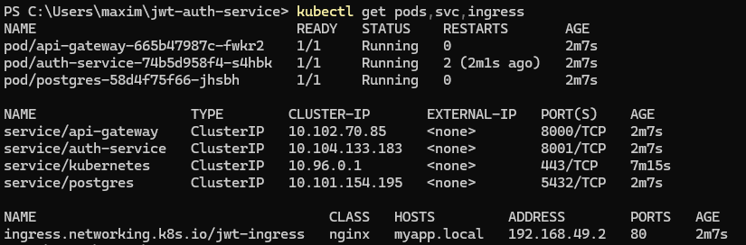
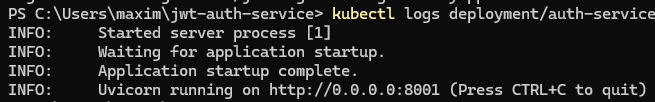
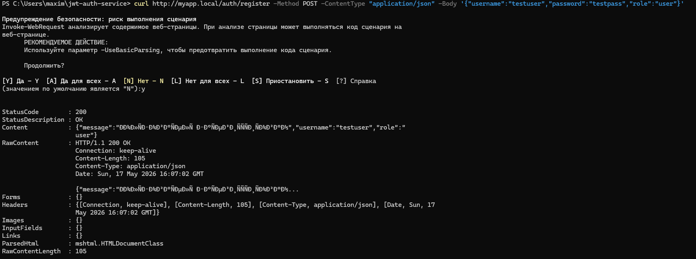

# Практика №3 - Контейнеризация и деплой в Kubernetes

**Тема:** Сервис генерации и валидации JWT токенов с ролями (Тема 19)  
**Студент:** Фокин Максим Юрьевич, группа ИКМО-06-25

---

## Ссылка на репозиторий

https://github.com/LonginOme/jwt-auth-service

---

## Список микросервисов и образов

| Микросервис | Docker-образ | Порт |
|---|---|---|
| API Gateway | api-gateway:latest | 8000 |
| Auth Service | auth-service:latest | 8001 |
| PostgreSQL | postgres:15 | 5432 |

---

## Инструкция по развёртыванию в Minikube

```bash
# 1. Запустить Minikube
minikube start --driver=docker

# 2. Переключиться на Docker внутри Minikube
minikube docker-env | Invoke-Expression

# 3. Собрать образы
docker build -t auth-service:latest practice2/services/auth_service/
docker build -t api-gateway:latest practice2/services/api_gateway/

# 4. Включить Ingress
minikube addons enable ingress

# 5. Применить манифесты
kubectl apply -f practice3/k8s/

# 6. Запустить туннель (в отдельном терминале)
minikube tunnel

# 7. Добавить запись в hosts
Add-Content -Path C:\Windows\System32\drivers\etc\hosts -Value "127.0.0.1 myapp.local"

# 8. Проверить доступность
curl http://myapp.local/health
```

---

## Скриншоты

### kubectl get pods,svc,ingress


### Логи Auth Service


### Успешный запрос через Ingress


---

## Описание манифестов

| Файл | Назначение |
|---|---|
| configmap.yaml | Хранит DATABASE_URL и AUTH_SERVICE_URL |
| secret.yaml | Хранит POSTGRES_PASSWORD и SECRET_KEY |
| deployment-postgres.yaml | Деплой PostgreSQL |
| service-postgres.yaml | ClusterIP сервис для PostgreSQL |
| deployment-auth.yaml | Деплой Auth Service |
| service-auth.yaml | ClusterIP сервис для Auth Service |
| deployment-gateway.yaml | Деплой API Gateway |
| service-gateway.yaml | ClusterIP сервис для API Gateway |
| ingress.yaml | Ingress для доступа через myapp.local |

---

## Вывод

В ходе практики микросервисное приложение из ПР10 было успешно развёрнуто
в локальном кластере Minikube. Все конфигурационные параметры вынесены
в ConfigMap и Secret. Приложение доступно извне через Ingress по адресу
http://myapp.local. Kubernetes обеспечивает изоляцию сервисов, управление
конфигурацией и возможность масштабирования без изменения кода приложения.
