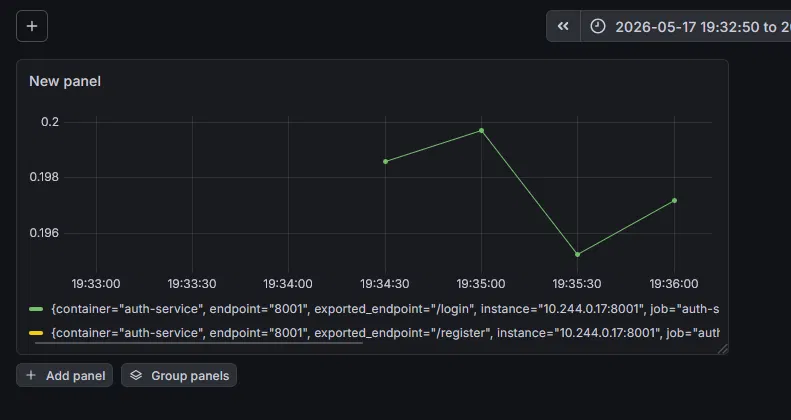
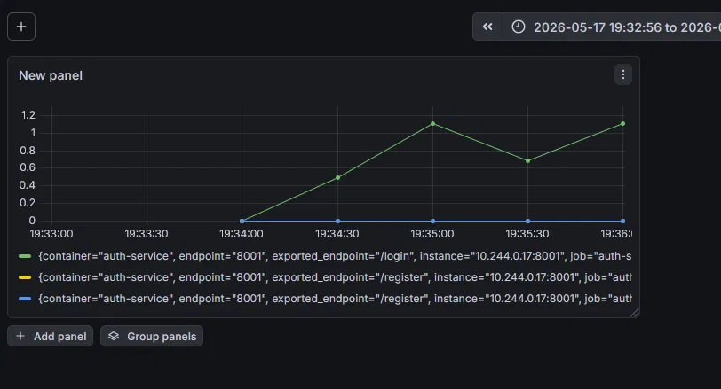
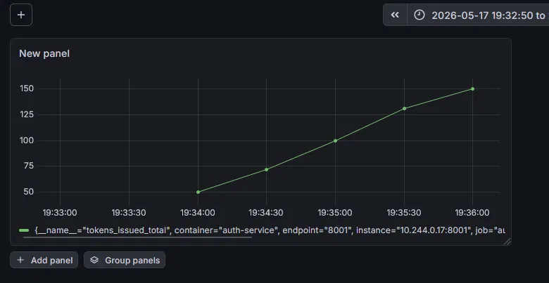

# Практика №4 — Мониторинг и наблюдаемость в Kubernetes

**Тема:** Сервис генерации и валидации JWT токенов с ролями (Тема 19)  
**Студент:** Фокин Максим Юрьевич, группа ИКМО-06-25

---

## Ссылка на репозиторий

https://github.com/LonginOme/jwt-auth-service

---

## Выбранная система мониторинга

**Prometheus + Grafana** (через Helm-чарт kube-prometheus-stack).

Выбрана как наиболее распространённая в production-среде связка для мониторинга
Kubernetes-кластеров. Prometheus обеспечивает сбор и хранение метрик,
Grafana — их визуализацию. Оба инструмента нативно интегрируются с Kubernetes
через ServiceMonitor и не требуют изменений в манифестах самого приложения.

---

## Экспортируемые метрики

| Метрика | Тип | Описание |
|---|---|---|
| `http_requests_total` | Counter | Счётчик HTTP-запросов по эндпоинтам и кодам ответа |
| `http_request_duration_seconds` | Histogram | Гистограмма времени ответа по эндпоинтам |
| `tokens_issued_total` | Counter | Счётчик выданных JWT токенов |
| `tokens_validated_total` | Counter | Счётчик валидаций токенов с результатом (valid/invalid/revoked) |
| `users_registered_total` | Counter | Счётчик зарегистрированных пользователей |

---

## Настройка сбора метрик

Сбор метрик настроен через **ServiceMonitor** — объект Kubernetes,
который сообщает Prometheus какие сервисы нужно опрашивать.

Сервис `auth-service` помечен лейблом `app: auth-service`,
ServiceMonitor выбирает его по этому лейблу и опрашивает
эндпоинт `/metrics` каждые 15 секунд.

---

## Дашборд

### Панель 1 — RPS (запросы в секунду)
Запрос: `rate(http_requests_total[1m])`  
Показывает интенсивность входящего трафика по каждому эндпоинту.

### Панель 2 — Время ответа (латентность)
Запрос: `rate(http_request_duration_seconds_sum[1m]) / rate(http_request_duration_seconds_count[1m])`  
Показывает среднее время обработки запроса в секундах.

### Панель 3 — Выданные токены (бизнес-метрика)
Запрос: `tokens_issued_total`  
Показывает накопленное количество выданных JWT токенов — ключевая бизнес-метрика сервиса аутентификации.

---

## Результаты нагрузочного теста

Выполнено 150 запросов на эндпоинт `/auth/login`.

| Метрика | До нагрузки | После нагрузки |
|---|---|---|
| `tokens_issued_total` | 0 | 150 |
| RPS | ~0 | ~0.2 req/s |
| Среднее время ответа | — | ~0.01–0.02 с |

На графике `tokens_issued_total` виден линейный рост — сервис стабильно
обрабатывал запросы без ошибок. Латентность оставалась низкой на протяжении
всего теста.

---

## Вывод

Мониторинг позволяет в реальном времени отслеживать состояние микросервисного
приложения: видеть нагрузку, выявлять деградацию производительности и отслеживать
бизнес-показатели. Без мониторинга в production невозможно своевременно обнаружить
проблемы — рост времени ответа, падение сервиса или аномальные значения метрик.
Prometheus + Grafana являются стандартом де-факто для Kubernetes-окружений
и обеспечивают гибкую настройку без изменения кода приложения.